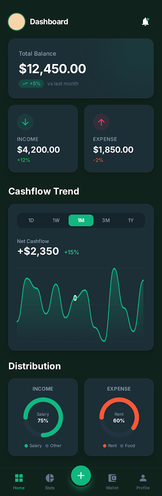
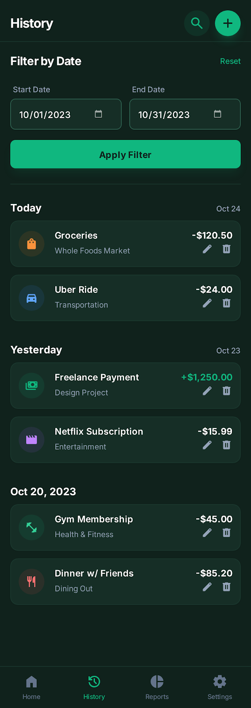
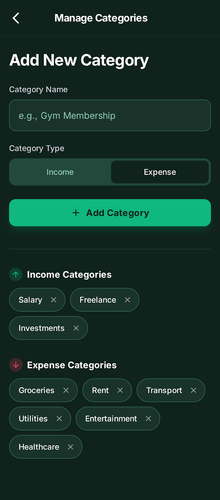

# 📘 Personal Finance Tracker - Deployment Guide

<div align="center">
  
  
  
</div>

## 🎯 Overview

Personal Finance Tracker adalah aplikasi web modern untuk mengelola keuangan pribadi dengan fitur:
- ✅ Setup saldo awal (liquid assets)
- ✅ Input transaksi pemasukan & pengeluaran
- ✅ Dashboard real-time dengan kalkulasi otomatis
- ✅ Filter waktu (Semua, Hari Ini, Minggu Ini, Bulan Ini)
- ✅ Riwayat transaksi dengan color coding
- ✅ Responsive design (Mobile & Desktop)

---

## 📁 Folder Structure

```
Personal Financial Tracker/
├── components/             # Reusable UI components (Dashboard, Modal, etc.)
│   ├── dashboard.js
│   ├── transaction-history.js
│   ├── transaction-modal.js
│   └── manage-categories.js
├── services/               # Firebase & Business Logic services
│   ├── firebase-service.js
│   ├── transaction-service.js
│   ├── category-service.js
│   └── settings-service.js
├── utils/                  # Utility & Helper functions
│   └── helpers.js
├── index.html              # Main application entry point
├── style.css               # Modern UI styling with Tailwind & CSS
├── app.js                  # Application initialization & routing
├── firebase-config.js      # Firebase configuration
└── README.md               # Project documentation
```

---

## 🚀 Setup Firebase

### Step 1: Buat Firebase Project

1. Buka [Firebase Console](https://console.firebase.google.com/)
2. Klik **"Add project"** atau **"Create a project"**
3. Masukkan nama project (contoh: `personal-finance-tracker`)
4. Ikuti wizard setup (Google Analytics opsional)
5. Klik **"Create project"**

### Step 2: Aktifkan Firestore Database

1. Di Firebase Console, pilih project Anda
2. Klik **"Firestore Database"** di menu sidebar
3. Klik **"Create database"**
4. Pilih mode:
   - **Production mode** (untuk production)
   - **Test mode** (untuk development - data dapat diakses publik selama 30 hari)
5. Pilih lokasi server (contoh: `asia-southeast1` untuk Singapore)
6. Klik **"Enable"**

### Step 3: Dapatkan Firebase Configuration

1. Di Firebase Console, klik ikon **⚙️ (Settings)** > **"Project settings"**
2. Scroll ke bawah ke bagian **"Your apps"**
3. Klik ikon **`</>`** (Web app)
4. Daftarkan app dengan nickname (contoh: `Finance Tracker Web`)
5. **Jangan** centang Firebase Hosting (kita akan setup manual)
6. Klik **"Register app"**
7. Copy konfigurasi yang muncul (akan terlihat seperti ini):

```javascript
const firebaseConfig = {
  apiKey: "AIzaSyXXXXXXXXXXXXXXXXXXXXXXXXXXXXX",
  authDomain: "your-project.firebaseapp.com",
  projectId: "your-project-id",
  storageBucket: "your-project.appspot.com",
  messagingSenderId: "123456789012",
  appId: "1:123456789012:web:abcdef1234567890"
};
```

### Step 4: Update firebase-config.js

1. Buka file `firebase-config.js`
2. Replace placeholder values dengan konfigurasi Anda:

```javascript
const firebaseConfig = {
    apiKey: "YOUR_API_KEY_HERE",              // Ganti dengan apiKey Anda
    authDomain: "YOUR_PROJECT_ID.firebaseapp.com",  // Ganti dengan authDomain Anda
    projectId: "YOUR_PROJECT_ID",             // Ganti dengan projectId Anda
    storageBucket: "YOUR_PROJECT_ID.appspot.com",   // Ganti dengan storageBucket Anda
    messagingSenderId: "YOUR_MESSAGING_SENDER_ID",  // Ganti dengan messagingSenderId Anda
    appId: "YOUR_APP_ID"                      // Ganti dengan appId Anda
};
```

3. Save file

---

## 🔒 Firestore Security Rules (Opsional)

Untuk production, update Firestore Security Rules:

1. Di Firebase Console, buka **"Firestore Database"** > **"Rules"**
2. Paste rules berikut:

```javascript
rules_version = '2';
service cloud.firestore {
  match /databases/{database}/documents {
    // Allow read/write to settings collection
    match /settings/{document=**} {
      allow read, write: if true;
    }
    
    // Allow read/write to transactions collection
    match /transactions/{document=**} {
      allow read, write: if true;
    }
  }
}
```

> [!WARNING]
> Rules di atas memperbolehkan akses publik. Untuk aplikasi production dengan multiple users, implementasikan Firebase Authentication dan update rules sesuai kebutuhan.

3. Klik **"Publish"**

---

## 💻 Local Testing

### Option 1: Live Server (Recommended)

1. Install VS Code extension **"Live Server"** by Ritwick Dey
2. Buka folder project di VS Code
3. Right-click pada `index.html` > **"Open with Live Server"**
4. Browser akan otomatis membuka aplikasi di `http://127.0.0.1:5500`

### Option 2: Python HTTP Server

```bash
# Python 3
python -m http.server 8000

# Buka browser ke http://localhost:8000
```

### Option 3: Node.js HTTP Server

```bash
# Install http-server globally
npm install -g http-server

# Run server
http-server -p 8000

# Buka browser ke http://localhost:8000
```

---

## 🌐 Deploy ke Firebase Hosting

### Step 1: Install Firebase CLI

```bash
npm install -g firebase-tools
```

### Step 2: Login ke Firebase

```bash
firebase login
```

### Step 3: Initialize Firebase Hosting

```bash
# Di folder project
firebase init hosting
```

Jawab pertanyaan:
- **"What do you want to use as your public directory?"** → Tekan Enter (default: `public`)
  - Atau ketik `.` jika ingin root folder sebagai public directory
- **"Configure as a single-page app?"** → `No`
- **"Set up automatic builds and deploys with GitHub?"** → `No`

### Step 4: Deploy

```bash
firebase deploy --only hosting
```

Setelah deploy selesai, aplikasi akan tersedia di:
```
https://your-project-id.web.app
```

---

## 📊 Firestore Data Structure

### Collection: `settings`

Menyimpan saldo awal user.

```javascript
{
  id: "initialBalance",
  amount: 5000000,           // Saldo awal dalam Rupiah
  updatedAt: Timestamp       // Waktu terakhir update
}
```

### Collection: `transactions`

Menyimpan semua transaksi pemasukan dan pengeluaran.

```javascript
{
  id: "auto-generated-id",
  type: "income" | "expense",  // Tipe transaksi
  category: "Gaji",            // Kategori
  amount: 500000,              // Jumlah dalam Rupiah
  date: Timestamp,             // Tanggal transaksi
  description: "Gaji bulanan", // Deskripsi
  createdAt: Timestamp         // Waktu dibuat
}
```

**Kategori Pemasukan:**
- Gaji
- Bonus
- Investasi
- Uang Ortu
- Lainnya

**Kategori Pengeluaran:**
- Makanan
- Transport
- Hiburan
- Tagihan
- Belanja
- Kesehatan
- Lainnya

---

## 🎨 Customization

### Mengubah Tema Warna

Edit CSS Variables di `style.css`:

```css
:root {
    /* Primary Colors */
    --primary-color: #6366f1;      /* Warna utama */
    --primary-dark: #4f46e5;       /* Warna primary gelap */
    
    /* Accent Colors */
    --income-color: #10b981;       /* Warna pemasukan (hijau) */
    --expense-color: #ef4444;      /* Warna pengeluaran (merah) */
    
    /* Background */
    --bg-color: #f8fafc;           /* Background body */
    --card-bg: #ffffff;            /* Background card */
}
```

### Mengubah Background Gradient

Edit di `style.css` bagian `body`:

```css
body {
    background: linear-gradient(135deg, #667eea 0%, #764ba2 100%);
    /* Ganti dengan gradient pilihan Anda */
}
```

---

## 🧪 Testing Checklist

- [x] ✅ Setup saldo awal berhasil tersimpan
- [x] ✅ Tambah transaksi pemasukan
- [x] ✅ Tambah transaksi pengeluaran
- [x] ✅ Dashboard menampilkan kalkulasi yang benar
- [x] ✅ Filter "Hari Ini" berfungsi
- [x] ✅ Filter "Minggu Ini" berfungsi
- [x] ✅ Filter "Bulan Ini" berfungsi
- [x] ✅ Hapus transaksi berfungsi
- [x] ✅ Real-time update saat data berubah
- [x] ✅ Responsive di mobile (320px - 480px)
- [x] ✅ Responsive di tablet (768px - 1024px)
- [x] ✅ Responsive di desktop (1200px+)
- [x] ✅ Loading state muncul saat fetch data
- [x] ✅ Alert sukses/error muncul dengan benar

---

## 🐛 Troubleshooting

### Error: "Firebase not defined"

**Solusi:** Pastikan `firebase-config.js` sudah di-update dengan credentials yang benar.

### Error: "Missing or insufficient permissions"

**Solusi:** Update Firestore Security Rules (lihat bagian Security Rules di atas).

### Data tidak muncul

**Solusi:** 
1. Buka Browser DevTools (F12) > Console
2. Periksa error messages
3. Pastikan Firebase project sudah aktif
4. Pastikan Firestore Database sudah dibuat

### Aplikasi tidak bisa diakses setelah deploy

**Solusi:**
1. Pastikan semua file ada di public directory
2. Jalankan `firebase deploy --only hosting` lagi
3. Clear browser cache dan refresh

---

## 📱 Browser Support

- ✅ Chrome (Recommended)
- ✅ Firefox
- ✅ Safari
- ✅ Edge
- ✅ Mobile browsers (iOS Safari, Chrome Mobile)

---

## 🔐 Security Notes

> [!CAUTION]
> Aplikasi ini menggunakan Firestore rules yang memperbolehkan akses publik. Untuk production dengan multiple users, implementasikan:
> - Firebase Authentication (Email/Password, Google Sign-In, dll.)
> - User-specific data isolation
> - Proper security rules

---

## 📞 Support

Jika ada pertanyaan atau issue:
1. Periksa Firebase Console untuk error logs
2. Buka Browser DevTools > Console untuk JavaScript errors
3. Pastikan semua dependencies ter-load dengan benar

---

## 📄 License

Free to use for personal and commercial projects.

---

**Happy Tracking! 💰📊**
